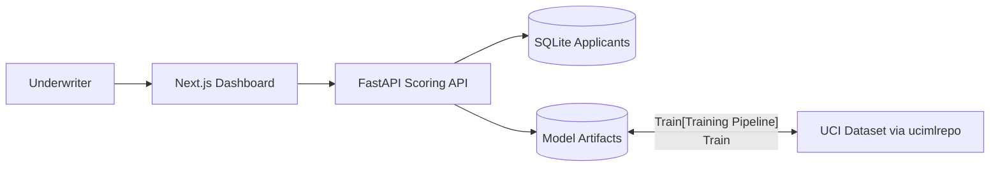
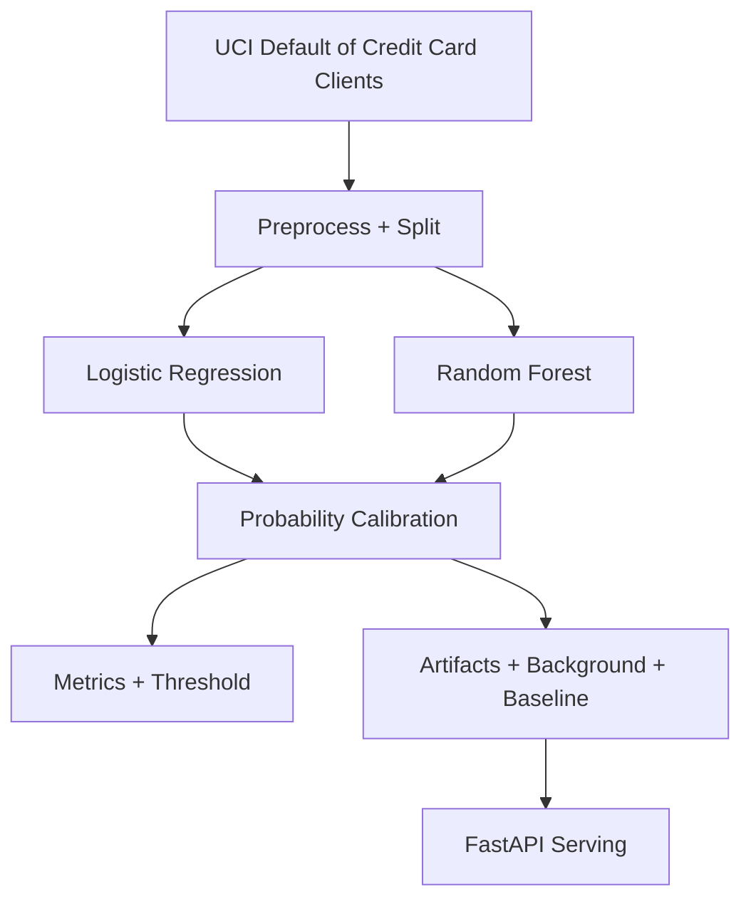

# CreditLens

CreditLens is a demo loan/credit default risk scoring platform with explainability, fairness diagnostics, and an underwriter dashboard.

> Demo project. Not for real lending decisions.

## Architecture


## ML Pipeline


## Repo Layout
- `apps/web`: Next.js dashboard
- `services/api`: FastAPI scoring service + training pipeline
- `docs`: model card and documentation
- `scripts`: utility scripts

## Quickstart (Local Dev)
```bash
pnpm install
python3 -m pip install -r services/api/requirements.txt

# Train model + save artifacts
python3 services/api/ml/train.py

# Terminal 1: API
cd services/api
python3 -m uvicorn app.main:app --reload

# Terminal 2: Web
cd apps/web
pnpm dev
```

Open `http://127.0.0.1:3000`.

## One-Command Verify + Run
Run tests first, then start both services if everything passes:
```bash
./scripts/run_all.sh
```

## Makefile Helpers
```bash
make train
make test
```

## Docker Compose
```bash
docker compose up --build
```

## Data
- Dataset downloaded automatically from UCI (id=350) via `ucimlrepo`.
- Data and model artifacts are cached locally and **not** committed to git.

## API Endpoints
- `GET /healthz`
- `GET /model/metadata`
- `GET /model/metrics`
- `GET /model/card`
- `GET /fairness/report`
- `GET /monitoring/summary`
- `GET /applicants?limit=&offset=`
- `GET /applicants/{id}`
- `POST /applicants`
- `POST /score`
- `POST /applicants/{id}/score`

## UI Pages
- `/dashboard`
- `/applicants`
- `/applicants/[id]`
- `/fairness`
- `/monitoring`
- `/model-card`

## Release Notes
See `RELEASE.md` for the latest release summary.

## Disclaimer
This project is for demonstration only and is **not** suitable for real lending decisions.
