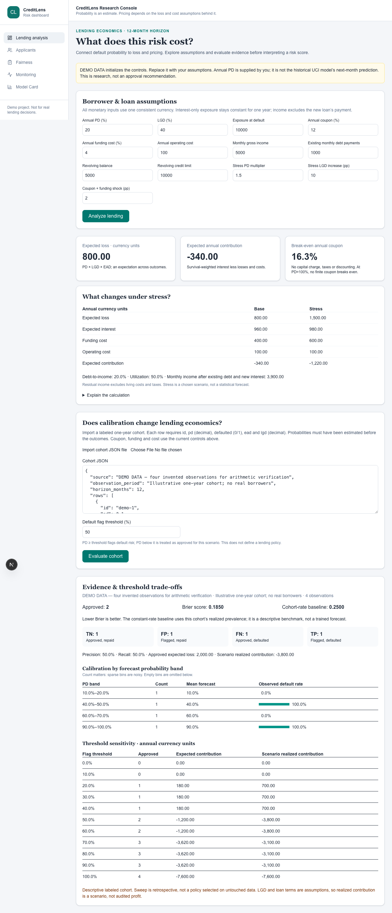

# CreditLens

**How does default risk change the return a lender needs?** CreditLens connects probability of default (PD), loss given default (LGD), exposure at default (EAD), borrower cash-flow capacity and loan pricing in an interactive research workbench.

A high coupon can still produce a negative expected contribution: defaulted loans lose principal and may never pay that coupon. CreditLens exposes this trade-off, then lets you investigate how miscalibrated probabilities and approval thresholds change the economics of a labeled cohort.



## What works

- Annual PD × LGD × EAD expected loss; survival-weighted interest, funding/operating cost, expected contribution and break-even coupon.
- Input-driven PD/LGD/rate stress, debt-to-income, utilization and income after debt and new interest payments.
- Import your own JSON cohort with source and observation period. Inspect calibration bins/counts, Brier score, confusion matrix, precision/recall and threshold economics.
- Existing UCI credit-card research pipeline: logistic and random-forest baselines, sigmoid calibration, held-out evaluation, applicant scoring, SHAP explanations, fairness diagnostics and feature monitoring.
- Validated FastAPI endpoints and responsive Next.js UI. Missing services/artifacts show **Data unavailable**; no invented replacement metrics.

**Research only.** The default workbench values and four-row cohort are explicitly labeled DEMO DATA. Calculations accept real user inputs, but these assumptions and historical research models are not a validated underwriting policy.

## Run locally

Requires Python 3.12, Node 22+ and pnpm 9.12.3. From the repository root:

```bash
python3.12 -m venv .venv
.venv/bin/pip install -r services/api/requirements-lock.txt
npx pnpm@9.12.3 install --frozen-lockfile
.venv/bin/python -m uvicorn app.main:app --app-dir services/api --port 8000
# In a second terminal:
npx pnpm@9.12.3 --filter web dev
```

Open [the workbench](http://localhost:3000/dashboard) and [API schema](http://localhost:8000/docs). No training, account, credentials or live provider is required for the lending/cohort workflow. For a different API host, copy `apps/web/.env.example` to `apps/web/.env.local`.

To train the optional historical model, run `.venv/bin/python -m ml.train` from `services/api` (use `../../.venv/bin/python` there). It downloads UCI data; failure leaves model reports unavailable. `SEED_APPLICANTS=true` explicitly opts into populating the research database from UCI at startup. Otherwise the applicant list starts empty and accepts submitted records.

## Reproduce the arithmetic

```bash
curl -s http://localhost:8000/analysis/lending -H 'Content-Type: application/json' \
  -d '{"pd":0.1,"lgd":0.4,"ead":10000,"annual_rate":0.12,"funding_rate":0.04,"operating_cost":100}'
```

Expected loss = 400; expected interest = 1,080; funding = 400; operating cost = 100; expected contribution = 180; break-even annual coupon = 10%. Binary floating-point output can differ at the last decimal. Monetary values share one user-selected currency.

## Verify

```bash
.venv/bin/ruff check services/api
.venv/bin/python -m pytest services/api/tests -q
npx pnpm@9.12.3 lint
npx pnpm@9.12.3 typecheck
npx pnpm@9.12.3 --filter web build
npx pnpm@9.12.3 --filter web exec playwright install chromium
npx pnpm@9.12.3 --filter web test
```

Browser tests start isolated API/web processes on ports 8103/3103 and do not require downloaded model data. CI runs installation, lint, TypeScript checking, formulas/invalid-data/API tests, Python compilation, production web build and browser journeys.

## Financial and engineering evidence

- [Methodology](docs/METHODOLOGY.md): assumptions, equations, probability horizons and threshold interpretation.
- [Architecture](docs/ARCHITECTURE.md): API/domain/data boundaries and reproducibility.
- [Data dictionary](docs/DATA_DICTIONARY.md): cohort import format and units.
- [Model card](docs/MODEL_CARD.md): historical dataset, split design, explanations and evaluation limits.
- [Limitations](docs/LIMITATIONS.md): what this application cannot establish.
- [Delivery evidence](docs/PORTFOLIO_DELIVERY.md): exact verification and revision status.

The historical UCI task estimates **default next month**, not an annual loan PD. CreditLens deliberately does not feed that probability into the annual pricing workbench. An analyst must provide a probability appropriate to the chosen annual exposure and borrower population.
