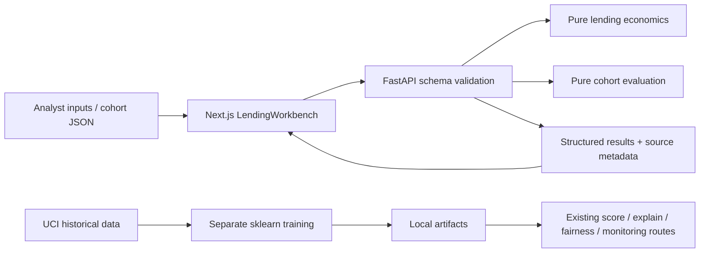

# Architecture

`app/lending.py` owns strict bounded Pydantic inputs and deterministic annual economics. `app/cohort.py` owns row validation, confusion/calibration and economic threshold sweeps. Neither module accesses a network or database. `app/main.py` exposes POST `/analysis/lending` and POST `/analysis/cohort`, limits body size including streamed requests, and preserves existing applicant/model routes.

`apps/web/src/lib/analysis.ts` is the typed API client. `LendingWorkbench.tsx` owns editable values, import, result/error states, economic decomposition and evidence tables. Inputs changed after a calculation are marked stale; cohort results are cleared when assumptions change. Pending requests disable editable inputs. No finance formula is copied into the browser.

The application keeps SQLite applicant records and model artifacts separate from the workbench. Automatic data download/seeding is disabled by default; opt in with SEED_APPLICANTS. Model files are local trusted joblib artifacts and must never be accepted from untrusted uploads. Cohort JSON is evaluated in memory, never trained on or persisted. No authentication, tenant isolation or deployment-grade audit log is provided.

Reproducibility: exact JavaScript package versions and pnpm lockfile; Python 3.12 requirements-lock.txt pins the observed environment. Pure analysis is deterministic for identical JSON. Imported source and observation period return with cohort results; retain input JSON with a report to reproduce it. The optional UCI training uses fixed random seeds and cached input data. Data/artifacts are gitignored.

CI installs locks, lints Python/TypeScript, typechecks frontend, runs domain/data/API/regression tests, compiles Python, builds production Next.js, and runs the actual browser→API journey. No credentials or live provider is required for CI.

`CREDITLENS_ARTIFACTS_DIR` optionally configures one shared training/serving artifact root. Browser tests set it to an isolated empty directory so model-unavailable behavior is tested even after a researcher trains locally. Validation errors return only location/type/message, preventing invalid nonfinite numbers or personal inputs from being echoed into JSON.
